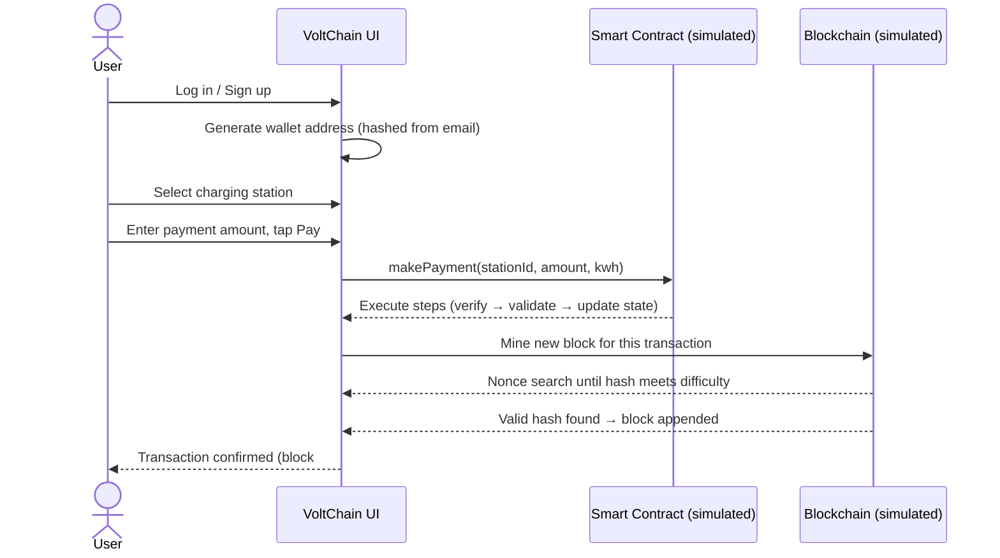

<div align="center">

# ⚡ VoltChain

### EV Charging Payment Simulation on a Visualized Blockchain

*A front-end simulation of blockchain-based payments for EV charging stations (SPKLU) — where Proof-of-Work mining and smart contract execution happen live, in the browser, in front of you.*

[](https://volt-chain-complete.vercel.app)


**[▶ Try the Live Demo](https://volt-chain-complete.vercel.app)**

</div>

---

## 📋 Table of Contents

- [Overview](#overview)
- [The Problem](#the-problem)
- [The Idea](#the-idea)
- [Key Features](#key-features)
- [How It Works](#how-it-works)
- [Tech Stack](#tech-stack)
- [Project Structure](#project-structure)
- [Running Locally](#running-locally)
- [Disclaimer](#disclaimer)

---

## Overview

VoltChain is a mobile-first web app that simulates how an EV charging network could settle payments on a blockchain: wallet balance, station discovery, token-based payment — and a **live, on-screen visualization** of the two things most blockchain apps hide from users: block mining and smart contract execution.

## The Problem

EV charging payment today runs through centralized processors and proprietary station networks — cross-provider payment and transaction transparency are hard to achieve. Blockchain micropayments are often pitched as the fix, but the mechanics behind them (mining, gas, smart contracts) stay invisible to the end user, making the concept hard to reason about or trust.

## The Idea

VoltChain models the full payment flow — wallet → station selection → token payment → on-chain confirmation — and pulls back the curtain on the parts that are usually a black box: you *watch* the Proof-of-Work search for a valid hash, and *watch* the smart contract execute step by step, in real time.

## ✨ Key Features

> 🔍 **The headline feature:** most "blockchain demo" projects fake a spinner and say "done." VoltChain actually renders the mining and contract execution process live.

| | |
|---|---|
| ⛏️ **Live mining visualization** | Watch nonce attempts and hash search happen in real time until a block hash meets the difficulty target |
| 📜 **Live smart contract trace** | Step-by-step execution of a `ChargingPayment` contract call — verify signature → check balance → validate station → execute → update state → emit event |
| 💳 **Wallet & token system** | TKN balance, transaction history, and a token purchase flow (credit card / bank transfer / crypto) |
| 🔌 **Station selection** | Each station carries its own simulated smart contract address and TKN→kWh conversion rate |
| 📊 **Blockchain status dashboard** | Live block height, network hashrate, difficulty, and last-block time |
| 🧩 **Zero backend** | 100% client-side — runs as a static site, no server or database needed |

## 🧠 How It Works



## 🛠 Tech Stack

| Layer | Technology |
|---|---|
| UI | Vanilla HTML / CSS / JavaScript |
| Icons | Font Awesome (CDN) |
| Blockchain logic | Custom `Block`, `Transaction`, `Blockchain`, `SmartContract` classes (`blockchain.js`) |
| Hashing | Simplified hash function built for visualizing PoW (`crypto.js`) |
| Persistence | `localStorage` (wallet, session, transaction history) |
| Deployment | Vercel (static hosting) |

## 📂 Project Structure

VoltChain/
├── index.html # App shell — all screens (login, wallet, payment, blockchain status)
├── style.css # UI styling
├── data.js # Mock user, station, and blockchain state
├── crypto.js # Simplified hashing + Proof-of-Work simulation
├── blockchain.js # Block / Transaction / Blockchain / SmartContract classes
├── app.js # UI logic, event handlers, mining & contract visualizations
└── data.json


## 🚀 Running Locally

No build step, no dependencies — it's a static site.

```bash
git clone https://github.com/Daffa-arynd/VoltChain-Complete.git
cd VoltChain-Complete

# Option A: just open it
open index.html

# Option B: serve it (recommended — avoids CORS issues with local files)
npx serve .
```

## ⚠️ Disclaimer

This is a **student system-design project** simulating blockchain-based EV charging payments, built for portfolio and learning purposes. It does not connect to a real blockchain network, does not use production-grade cryptography, and should never be used to handle real funds or personal data.

---

<div align="center">

Part of a portfolio by **[Daffa Ariyuanda](https://github.com/Daffa-arynd)** — see also [EVOS](https://github.com/Daffa-arynd/evos-skripsi), an EV recommendation system using ML.

</div>
